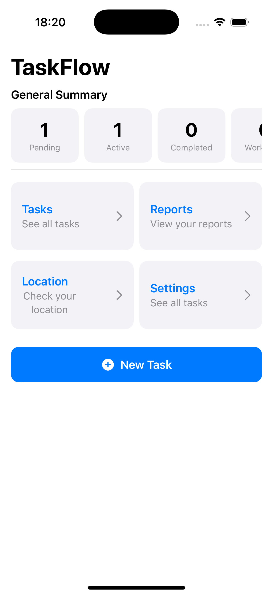
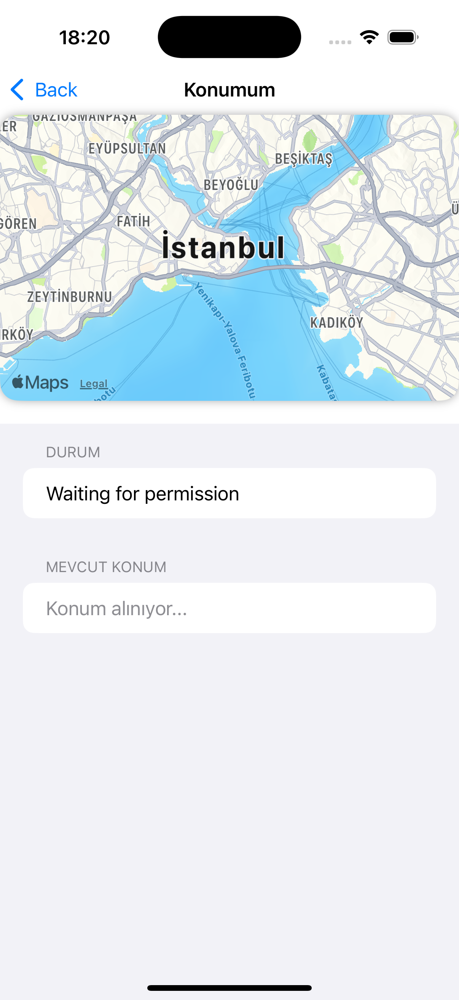
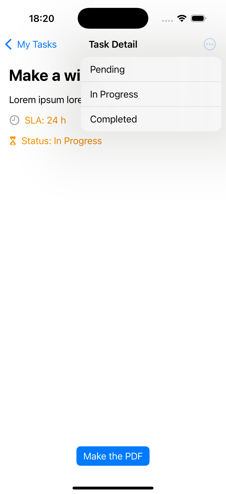
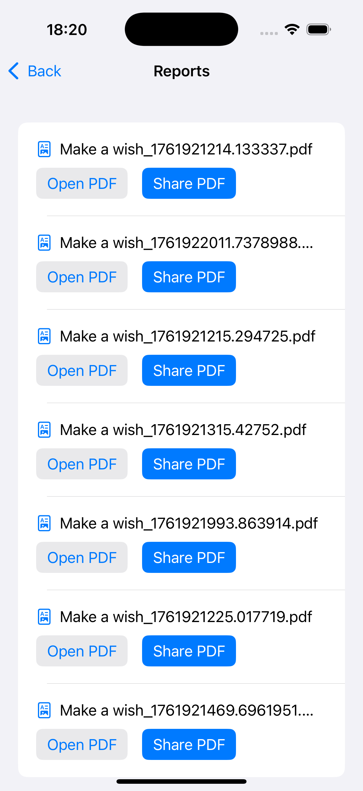
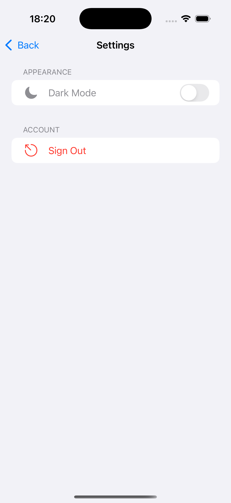

# 📱 TaskFlow

TaskFlow is a SwiftUI-based iOS application designed to manage tasks efficiently.  
It helps users track task progress, update statuses, and generate detailed PDF reports for completed tasks.

---

## Features

-  Create, view, and manage tasks  
-  Automatic SLA (Service Level Agreement) tracking  
-  Status transitions: *Pending → In Progress → Completed*  
-  Generate detailed PDF reports for completed tasks  
-  View and share generated PDF reports  
-  Automatically saves reports in the app’s local documents directory  

---

## Architecture

The project follows the **MVVM (Model-View-ViewModel)** pattern for better scalability and separation of concerns.

## Technologies Used
- SwiftUI
- PDFKit / UIKit (for sharing)
- MVVM architecture
- FileManager for local storage
-  Firebase Auth
-  Firebase Firestore
  
## 📸 Screenshots
| Home View | Location View| Task Detail | Reports View | Settings View |
|--------------|--------------|---------------|---------------|---------------|
| |  |  |  |  |

## 📦 Installation
- Clone the repository:
  - ```git clone https://github.com/yourusername/TaskFlow.git```

- Open the project in Xcode:
  - ```open TaskFlow.xcodeproj```

- Build and run on a simulator or device:
  - ```Cmd + R```


